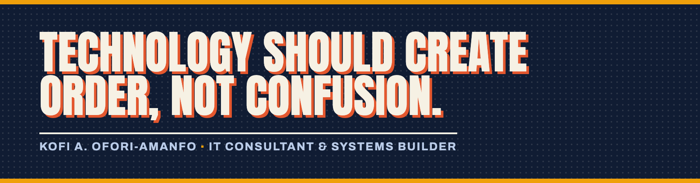
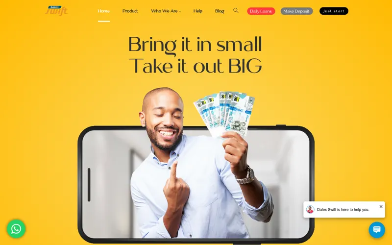
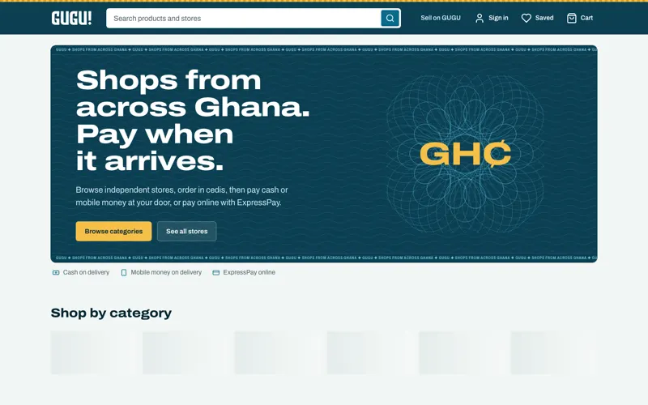
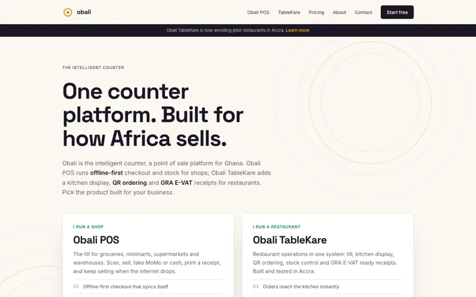
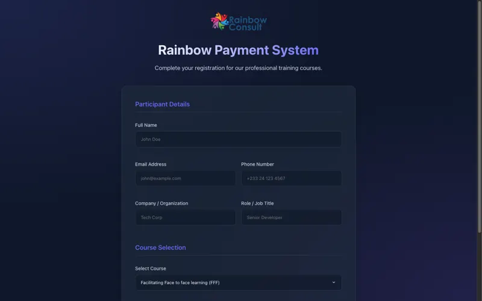

# Hey, I'm Kofi 👋

**IT consultant & systems builder · fintech, commerce, and the infrastructure underneath**

I'm an IT consultant in Accra 🇬🇭, working worldwide 🌍. For eight-plus years I've built the
systems businesses run on: lending platforms, marketplaces, point of sale, and the
infrastructure that keeps them up. Currently Senior Full Stack Software Developer at
[AfroQuality](https://shop.afroquality.com/gh/) and founder of Apex-Meta.

Most of my work lives in client and company repos, so this profile is quiet. The public
record is my portfolio: **[kofiamanfo.dev](https://kofiamanfo.dev)** ✨

## 🚀 What I ship

- 🏦 **Fintech platforms:** lending, micro-investments, and the reconciliation behind them, for regulated finance houses
- 🛒 **Commerce systems:** multi-vendor marketplaces, storefronts, and offline-first point of sale built for how Africa sells
- 🌐 **Corporate websites:** fifteen-plus live sites that make real businesses easier to find and easier to trust
- 🔧 **Infrastructure & IT operations:** Microsoft 365, networks, servers, and Starlink rollouts across multi-site operations

## 🏆 Highlighted work

<table>
  <tr>
    <td width="25%"> <b><a href="https://www.dalexswift.com">Dalex SWIFT</a></b> Micro-investment PWA for a Ghanaian finance house. Development lead.</td>
    <td width="25%"> <b><a href="https://gugumarket.web.app">GUGU Unlimited</a></b> Multi-vendor marketplace, live on web &amp; mobile. PM and lead systems designer.</td>
    <td width="25%"> <b><a href="https://getobali.com">Obali</a></b> Point of sale built for how Africa sells: offline-first, QR ordering. Product owner.</td>
    <td width="25%"> <b><a href="https://rainbow-payment-system-v1.web.app">Rainbow Payments</a></b> Course registration &amp; GHS payments for a training arm. Development lead.</td>
  </tr>
</table>

Also: **Dalex FILMS** 🔐. I inherited a live lending platform insecure and slow, then hardened and refactored it.
And **[twenty-plus more, most of them live →](https://kofiamanfo.dev/portfolio)**

## 🪜 Not just behind a desk

Two years as IT Manager for a mining services firm in Tarkwa: servers, networks, storage,
and a Starlink rollout across **four sites**. When something I shipped breaks, I am the one
they call. Sometimes that means a keyboard; sometimes it means a hard hat and a ladder. 👷

The unglamorous half of the job is the half that keeps everything standing: IT policy,
functional requirements, documentation, and systems that survive their builders.

 

## ✍️ Writing

First pieces are in the works at [kofiamanfo.dev](https://kofiamanfo.dev/blog). What I'm writing about:

- 🔄 Digital transformation for growing businesses: moving off manual processes without overwhelming your team
- 🧩 Why most internal tools fail, and how to design systems people actually want to use
- 🇬🇭 Technology planning for Ghanaian businesses: choosing stacks that hold up in emerging markets

## 🧰 What I work with

Plus payments (PayStack, ExpressPay) 💳 · ERP integration (Odoo) 🔗 · UiPath RPA 🤖

## 📬 Reach me

> *"Technology should create order, not confusion."*

If you are building something, or something you run is not working:

